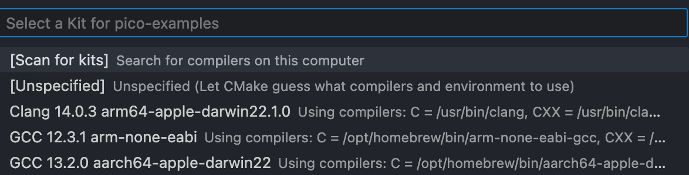
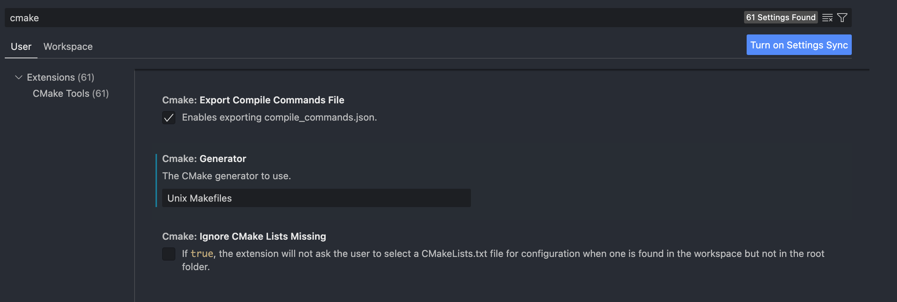
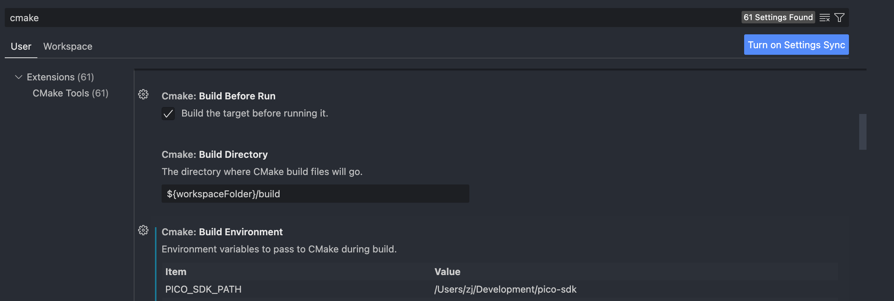

# Setting Up PICO SDK Environment on Apple Silicon MacOS

## Reference Guide
[Robert's Setup Guide](https://www.robertthasjohn.com/amp/how-to-set-up-the-raspberry-pi-pico-for-development-on-macos)
However, the ARmMbed formulae is outdated and does not have the full libraries to support CMake and gcc compiler for PICO SDK environment on MacOS, as of 8 Sept 23.
See github issues [1](https://github.com/raspberrypi/pico-feedback/issues/350), [2](https://github.com/raspberrypi/pico-feedback/issues/344), [3](https://github.com/raspberrypi/pico-sdk/issues/1482)

## Install Toolchain
`brew install cmake`
`brew install --cask gcc-arm-embedded`
This would install an older version of Arm GCC v12.3.1 but contains all the toolchains and libraries necessary to compile and build. 
 
 ## Alternative Toolchain Installation (optional)
[GNU Toolchain](https://developer.arm.com/Tools%20and%20Software/GNU%20Toolchain), manual installation and compilation followed by exporting the correct file paths on to your terminal and IDE. This will contain the latest version of Arm GCC toolchains.

## Clone Repositories
`git clone -b master https://github.com/raspberrypi/pico-sdk.git`
`cd pico-sdk`
`git submodule update --init`

Get full path of pico-sdk with `pwd`
Copy path and export to envrionment variable in ~/.bash_profile or ~/.zshrc
'export PICO_SDK_PATH={path to pico-sdk from pwd}'

`cd ..`
`git clone -b master https://github.com/raspberrypi/pico-examples.git`

## Configuring VSCode
In pico-examples folder,
`mkdir .vscode`
`cd .vscode`
`nano settings.json`

Copy this code into settings.json
```
[
  "cmake.environment": {
    "PICO_SDK_PATH":"../../pico-sdk"
  }
]
```

Open VSCode into your pico-examples folder,
Install "CMake Tools Extension" and "C/C++ Extension Pack" from Microsoft in the Extensions tab.

After installation, IDE will ask whether to configure project to work with CMake and click yes.


Select the correct compiler,


Go to VSCode settings page,
Adjust Cmake: Generator


Adjust Cmake: environment, Cmake: configure environement and Cmake: build environment with this file path



